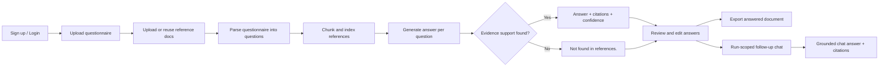

# Nexora

Nexora is a web app for teams that answer security/compliance questionnaires using internal source-of-truth documents.
It takes a questionnaire file, grounds each answer in uploaded references, and gives reviewers an edit + export workflow.

## Quick Links
- Live App: https://nupreeth-nexora.hf.space
- Space: https://huggingface.co/spaces/Nupreeth/Nexora
- GitHub: https://github.com/Nupreeth/Nexora

## Product Flow


## What It Does
- Authentication: signup, login, logout (`Flask-Login`)
- Signup safety: confirm-password validation
- Persistent data: SQLAlchemy models (SQLite local, external Postgres in deployment)
- Questionnaire parsing: CSV, XLSX, PDF, TXT
- Reference ingestion: TXT, MD, PDF, DOCX, CSV, XLSX
- Grounded answer generation with citations
- Strict unsupported fallback: `Not found in references.`
- Review/edit step before export
- Run-scoped follow-up chat (default to run references; optional full-library toggle)
- Export:
  - CSV/XLSX input -> answered CSV/XLSX with added answer columns
  - PDF input -> answered PDF output

## Domain Setup Used
- Industry: B2B SaaS for supply chain/procurement operations
- Fictional company: **CrestPilot Logistics Cloud**

CrestPilot helps manufacturers and distributors manage vendor onboarding, shipment operations, and procurement workflows.
It regularly receives vendor security and compliance questionnaires from enterprise customers.

Included sample data:
- Company profile: `sample_data/company_profile.md`
- Questionnaire (12 questions): `sample_data/questionnaire.csv`
- References (6 docs): `sample_data/references/*`

## Capability Coverage
| Capability | Status | Notes |
|---|---|---|
| User authentication | Done | Session auth with hashed passwords |
| Persistent database storage | Done | SQLAlchemy models; external Postgres via `DATABASE_URL` |
| Upload -> generate -> export workflow | Done | End-to-end in dashboard/review |
| AI meaningful work | Done | Retrieval + extractive grounded answering |
| Citation-backed outputs | Done | Citations + evidence snippets |
| Unsupported answer handling | Done | Returns exact fallback text |
| Review/edit before export | Done | Reviewer can edit answers/citations |
| Structure-preserving export | Done | Preserves question order and appends answers |

Nice-to-have features implemented:
- Confidence score
- Evidence snippets
- Coverage summary
- Version history (runs)

## Architecture
```text
run.py / wsgi.py
app/
  __init__.py            # app factory and registrations
  config.py              # env-driven configuration
  extensions.py          # db + login manager
  models.py              # users, questionnaires, runs, answers, chat
  routes/
    auth.py              # auth endpoints
    workflow.py          # upload/generate/review/export/chat
  services/
    parser_service.py    # questionnaire/reference parsing
    retrieval_service.py # chunking + tf-idf retrieval + answer synthesis
    export_service.py    # csv/xlsx/pdf export builders
  templates/
  static/css/
tests/
sample_data/
```

## Retrieval/Answering Design
For each run:
1. Parse questionnaire into ordered questions.
2. Parse and chunk reference documents.
3. Build TF-IDF index over chunks.
4. Retrieve top relevant chunks per question.
5. Compose extractive answer from supported sentences.
6. Attach citations and evidence snippets.
7. If support is weak/absent, return `Not found in references.`

## Assumptions
- Uploaded questionnaires are reasonably structured and contain detectable question rows.
- For spreadsheets, preserving row order and appending answer columns is acceptable.
- In weak-support situations, deterministic not-found is safer than speculative completion.

## Trade-offs
- Chose TF-IDF retrieval over external LLM calls for deterministic behavior, lower cost, and easier auditability.
- Used straightforward Flask + SQLAlchemy architecture to keep core flow reliable and maintainable.
- Used `db.create_all()` for simplicity in this scope; migrations would be preferred for a larger production setup.

## If I Had Two More Days
1. Improve answer quality controls (question-type logic + stronger citation validation gates).
2. Improve PDF fidelity for closer template-level layout parity.
3. Add audit trail for reviewer edits at field level.
4. Add async/background jobs for larger uploads.

## Local Setup
Prerequisites: Python 3.10+ (3.11 recommended)

```powershell
python -m venv .venv
.\.venv\Scripts\Activate.ps1
pip install -r requirements.txt
python run.py
```

App URL: `http://127.0.0.1:5000`

## Quick Demo
1. Sign up or log in.
2. Upload `sample_data/questionnaire.csv`.
3. Upload files from `sample_data/references/`.
4. Click `Generate Answers Now`.
5. Review/edit answers and citations.
6. Export answered document.

## Testing
```powershell
pytest
```

Current test coverage includes:
- Questionnaire parsing behavior
- Retrieval not-found grounding behavior
- Spreadsheet export integrity

## Deployment
Included:
- `Dockerfile`
- `Procfile`
- `wsgi.py`

Required environment variables:
- `SECRET_KEY`
- `DATABASE_URL`

Persistence note:
- Use managed Postgres (Neon/Supabase/etc.) for durable storage.
- App normalizes `postgres://...` and `postgresql://...` URLs automatically.

Hugging Face deployment guide:
- See `DEPLOY_HF_SPACES.md`
